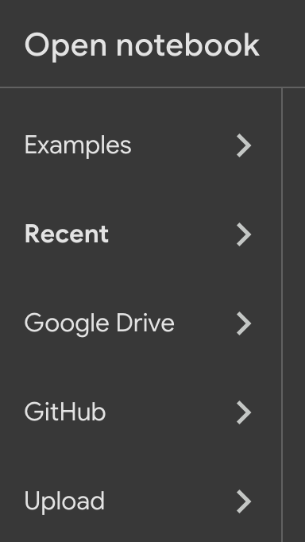
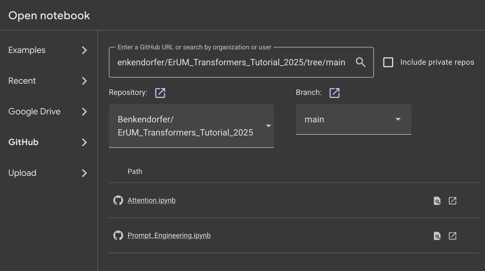

# 2025 Transformers Tutorial

- [2025 Transformers Tutorial](#2025-transformers-tutorial)
  - [Cloning the repository](#cloning-the-repository)
  - [Dataset](#dataset)
  - [Running locally (faster, but requires `conda`)](#running-locally-faster-but-requires-conda)
  - [Running on Google Colab](#running-on-google-colab)

## Cloning the repository

This repository makes use of `git submodule`. You can clone it with

```bash
git clone --recursive ssh://git@gitlab.cern.ch:7999/kbenkend/erum_transformers_tutorial_2025.git
```

or, if you do not have an `ssh` key installed in GitHub,

```bash
git clone --recursive https://github.com/Benkendorfer/ErUM_Transformers_Tutorial_2025.git
```

## Dataset

The dataset comes from <https://github.com/Charlie9/enron_intent_dataset_verified?tab=readme-ov-file>

## Running locally (faster, but requires `conda`)

To run locally, you can create a `conda` environment from the `environment_short.yml` file like so

```bash
conda env create -n ErUM --file environment_short.yml

conda activate ErUM
```

Then you can launch the Jupyter notebook in whatever way you prefer. An easy way to do it is to navigate to the directory where you downloaded the git repository and run

```bash
cd <path-to-tutorial-repo>
jupyter notebook
```

This should launch a Jupyter interface in your web browser.

## Running on Google Colab

To run on Google Colab, navigate to <https://colab.research.google.com/> in your browser. You should be presented with a popup asking you to open a notebook. There will be an option for GitHub --- click that.



Then in the search box, input the URL

```txt
https://github.com/Benkendorfer/ErUM_Transformers_Tutorial_2025/tree/main
```

You will see two options appear.



Click on the desired notebook (we will start with the one called `Attention`, and finish with `Prompt_Engineering`).

In the `Attention` notebook, you will first need to run the code in the section titled `Setup for Google Colab`. This will set up the environment for everything to run correctly. It may take 2-5 minutes, so please be patient.
